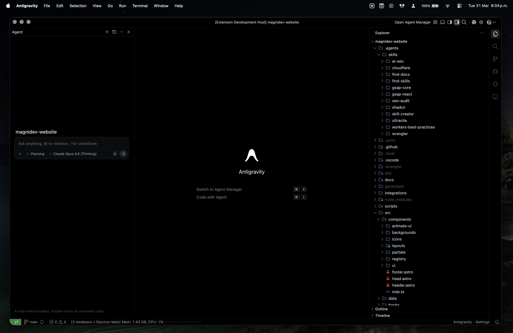
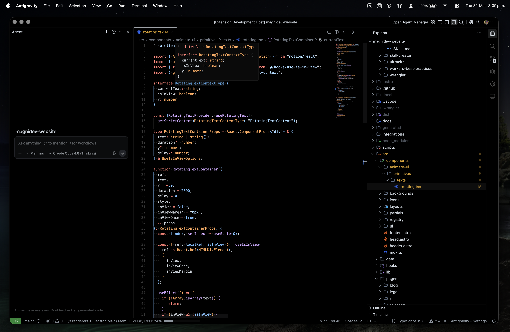

<p align="center">
  
</p>

<h1 align="center">Fluent OLED</h1>

<p align="center">
  <strong>A pure black, minimalist theme for VS Code and VS Code-based editors.</strong>
</p>

<p align="center">
  <a href="https://marketplace.visualstudio.com/items?itemName=fermeridamagni.fluent-oled"></a>
  <a href="https://open-vsx.org/extension/fermeridamagni/fluent-oled"></a>
  <a href="https://marketplace.visualstudio.com/items?itemName=fermeridamagni.fluent-oled"></a>
  <a href="LICENSE"></a>
</p>

---

## About

Fluent OLED strips the editor down to what matters — **your code**. Every surface is `#000000` pure black, designed for OLED and AMOLED displays where true black means pixels are completely off. The result is a distraction-free, power-efficient coding experience with zero visual noise.

Syntax highlighting follows the **GitHub Dark** palette — familiar, readable, and battle-tested by millions of developers.

<p align="center">
  
</p>

---

## Features

- ⬛ **True OLED Black** — `#000000` across the entire workbench: editor, sidebar, tabs, activity bar, status bar, terminal, and panels

- 🔘 **Monochrome UI** — white and gray accents only, keeping the chrome invisible so your code takes center stage

- 🎨 **GitHub Syntax Highlighting** — the proven GitHub Dark token palette with semantic highlighting support for TypeScript, JavaScript, and more

- ✨ **Ultra-Subtle Borders** — hairline `#111111` separators that vanish on OLED screens, creating a seamless canvas

- 🌗 **Power Efficient** — true black pixels are turned off on OLED/AMOLED displays, saving battery on laptops

- 🔌 **Universal Compatibility** — works on VS Code, Cursor, Windsurf, Antigravity, and any VS Code-based editor

---

## Install

### VS Code Marketplace

1. Open **Extensions** (`Ctrl+Shift+X` / `Cmd+Shift+X`)
2. Search for **Fluent OLED**
3. Click **Install**
4. Open **Preferences → Color Theme** → select **Fluent OLED**

Or install via the command line:

```sh
code --install-extension fermeridamagni.fluent-oled
```

### Open VSX

Available on [Open VSX](https://open-vsx.org/extension/fermeridamagni/fluent-oled) for editors that use the Open VSX registry.

### From Source

```sh
git clone https://github.com/fermeridamagni/fluent-oled.git
cd fluent-oled
```

Then symlink or copy the folder into your editor's extensions directory and restart.

---

## Color Palette

### UI Chrome

| Element    | Hex       | Usage                                    |
| ---------- | --------- | ---------------------------------------- |
| Background | `#000000` | Editor, sidebar, tabs, panels, terminal  |
| Surface    | `#0a0a0a` | Widgets, dropdowns, hover states         |
| Border     | `#111111` | Panel dividers, section separators       |
| Elevated   | `#161616` | Active selections, focused items         |
| Foreground | `#c9d1d9` | Primary text, active elements            |
| Secondary  | `#8b949e` | Descriptions, status bar text            |
| Muted      | `#6e7681` | Inactive tabs, breadcrumbs, placeholders |

### Syntax Tokens

| Token           | Hex       | Example                                  |
| --------------- | --------- | ---------------------------------------- |
| Keywords        | `#ff7b72` | `import` `const` `return` `if` `export`  |
| Functions       | `#d2a8ff` | `useState` `handleClick` `fetchData`     |
| Strings         | `#a5d6ff` | `"hello world"` `'path/to/file'`         |
| Constants       | `#79c0ff` | `true` `null` `42` `Math.PI`             |
| Types / Classes | `#ffa657` | `string` `HTMLElement` `Promise`         |
| Tags            | `#7ee787` | `<div>` `<Button>` `<section>`           |
| Comments        | `#8b949e` | `// descriptive comment`                 |
| Variables       | `#c9d1d9` | `data` `index` `result`                  |

---

## Recommended Settings

For the best experience, pair Fluent OLED with these editor settings:

```jsonc
{
  // Hide unnecessary chrome
  "editor.minimap.enabled": false,
  "editor.scrollbar.vertical": "hidden",
  "editor.overviewRulerBorder": false,
  "editor.hideCursorInOverviewRuler": true,
  "editor.renderLineHighlight": "gutter",

  // Clean up the workbench
  "workbench.activityBar.location": "top",
  "workbench.layoutControl.enabled": false,
  "breadcrumbs.enabled": false,
  "window.commandCenter": true,

  // Smooth editing
  "editor.cursorBlinking": "smooth",
  "editor.cursorSmoothCaretAnimation": "on",
  "editor.smoothScrolling": true,
  "workbench.list.smoothScrolling": true
}
```

---

## Contributing

Contributions are welcome. Please read the [Contributing Guide](CONTRIBUTING.md) before submitting a pull request.

## License

This project is licensed under the [MIT License](LICENSE).
